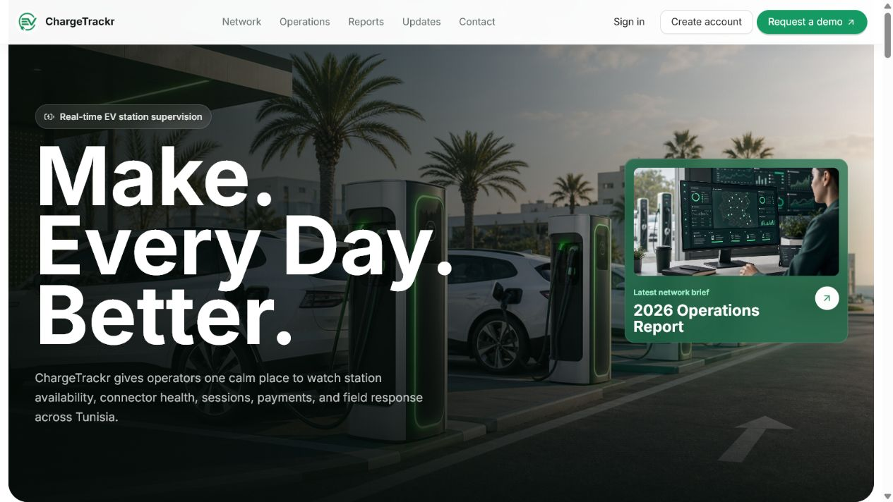
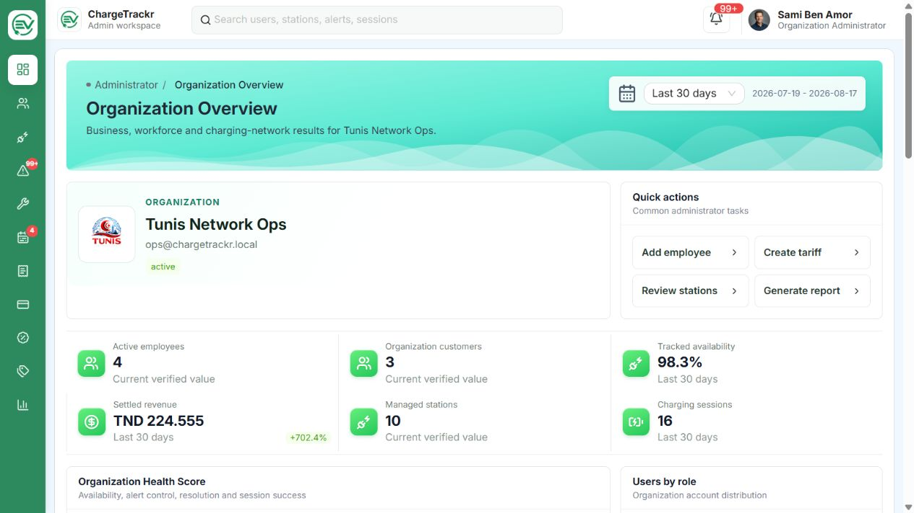
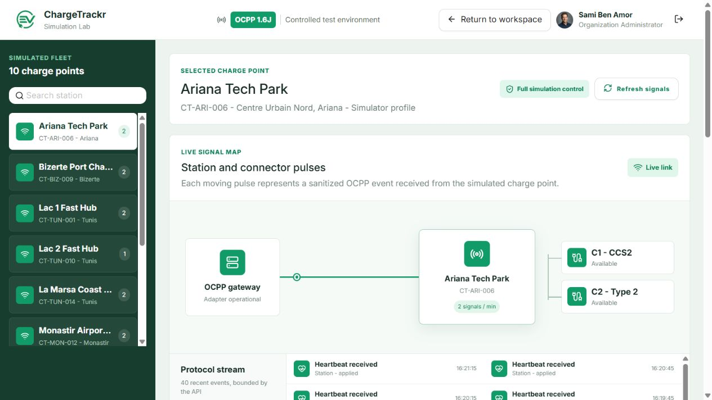
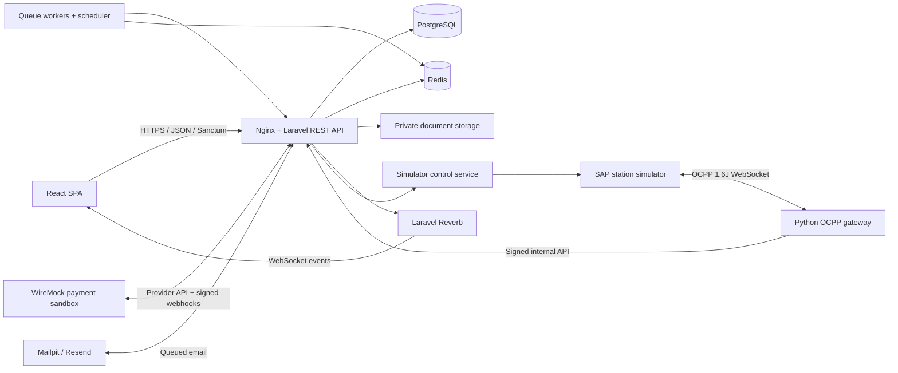

<p align="center">
  
</p>

<h1 align="center">ChargeTrackr</h1>

<p align="center">
  A multi-role platform for operating EV charging networks, supervising OCPP
  stations, managing charging sessions, and coordinating field operations.
</p>

<p align="center">
  <a href="https://chargetrackr.me"><strong>Live platform</strong></a>
  &nbsp;|&nbsp;
  <a href="https://1drv.ms/v/c/a087f1f584265db1/IQCIAt1JRSaZSaV3VEdsPAjLASDhXXfYAO7R0siK5-lyxV4?e=phgMDb"><strong>Video demo</strong></a>
  &nbsp;|&nbsp;
  <a href="docs/api/README.md"><strong>REST API</strong></a>
  &nbsp;|&nbsp;
  <a href="docs/report/output/pdf/charge-trackr-rapport-stage.pdf"><strong>Project report</strong></a>
</p>

<p align="center">
  <a href=".github/workflows/ci.yml"></a>
  <a href=".github/workflows/deploy-production.yml"></a>
  <a href="https://chargetrackr.me"></a>
  <a href="docs/api/openapi.json"></a>
  <a href="docs/ocpp.md"></a>
</p>

---

## Contents

- [Overview](#overview)
- [Product Preview](#product-preview)
- [Core Capabilities](#core-capabilities)
- [Roles and Scope](#roles-and-scope)
- [Architecture](#architecture)
- [Technology Stack](#technology-stack)
- [Repository Layout](#repository-layout)
- [Quick Start With Docker](#quick-start-with-docker)
- [Environment Configuration](#environment-configuration)
- [Local Services](#local-services)
- [Demo Accounts](#demo-accounts)
- [Native Development](#native-development)
- [OCPP Simulation](#ocpp-simulation)
- [Payment Simulation](#payment-simulation)
- [REST API](#rest-api)
- [Tests and Quality Gates](#tests-and-quality-gates)
- [Security Baseline](#security-baseline)
- [Production Deployment](#production-deployment)
- [Documentation and Deliverables](#documentation-and-deliverables)
- [Current Limits and Perspectives](#current-limits-and-perspectives)
- [Project Context](#project-context)

## Overview

ChargeTrackr brings the operational and customer workflows of an electric
vehicle charging network into one web application. It provides organization
management, station commissioning, calculated availability, real-time OCPP
supervision, charging sessions, simulated payments, maintenance workflows,
commercial subscriptions, and role-specific reporting.

The application is deployed at [chargetrackr.me](https://chargetrackr.me). Its
production environment runs on an Azure virtual machine with immutable Docker
images published through GitHub Actions.

This project was developed during a software engineering summer internship at
**TAC-TIC Tunisia**, from 01/07/2026 to 31/08/2026, after the first engineering
year in Software Engineering at the Faculty of Sciences of Tunis.

## Product Preview



<table>
  <tr>
    <td width="50%" align="center">
      
      <br><strong>Organization operations</strong>
    </td>
    <td width="50%" align="center">
      
      <br><strong>OCPP Simulation Lab</strong>
    </td>
  </tr>
</table>

Additional role-specific captures are available in
[`docs/manuals/assets/screenshots`](docs/manuals/assets/screenshots).

## Core Capabilities

| Domain                  | Capabilities                                                                                                                                |
| ----------------------- | ------------------------------------------------------------------------------------------------------------------------------------------- |
| Access and onboarding   | Client registration, Google OAuth, email verification, demo requests, organization trials, and single-use employee invitations              |
| Organizations and users | Multi-tenant organizations, scoped employees and customers, role assignment, activation, suspension, and audit trails                       |
| Charging assets         | Station and connector inventory, map-based positioning, documents, QR labels, commissioning, and remote commands                            |
| OCPP supervision        | OCPP 1.6 JSON gateway, heartbeats, status notifications, transactions, meter values, command results, and live signal visualization         |
| Availability            | Server-side projections calculated from connectivity, connector states, active sessions, maintenance, and heartbeat timeouts                |
| Driver workflow         | Station discovery, connector selection, guided plugging, charging target estimation, payment authorization, live session, stop, and receipt |
| Payments and pricing    | Tariffs, charging plans, pre-authorization, capture, release, idempotency, signed webhooks, invoices, and simulated provider failures       |
| Field operations        | Alerts, technician assignment, interventions, before/after evidence, maintenance plans, priorities, SLA tracking, and history               |
| Commercial management   | SaaS plans, organization trials, capacity limits, plan change requests, renewals, invoices, and subscription status                         |
| Reporting               | Role-specific analytics, PDF/CSV/JSON exports, internal report exchange, attachments, receipts, and operational handovers                   |
| Real time               | Laravel Reverb events for station state, notifications, charging measurements, assignments, and operational updates                         |

## Roles and Scope

| Role          | Main responsibility                                                                                      | Data boundary                         |
| ------------- | -------------------------------------------------------------------------------------------------------- | ------------------------------------- |
| Super Admin   | Govern organizations, commercial plans, integrations, global settings, demo requests, and platform audit | Entire platform                       |
| Administrator | Manage one organization's workforce, customers, charging assets, pricing, billing, and reports           | Assigned organization                 |
| Operator      | Supervise stations, connectors, sessions, alerts, and operational maintenance                            | Assigned organization                 |
| Technician    | Consult stations, receive assignments, execute interventions, attach evidence, and complete reports      | Assigned organization                 |
| Client        | Find stations, start and monitor charging, pay, download receipts, and manage network memberships        | Personal account across organizations |

Administrators, operators, and technicians belong to exactly one organization.
Client accounts remain independent and can interact with multiple charging
networks. Authorization and organization isolation are enforced server-side.

## Architecture



The frontend and backend follow a client-server architecture. Laravel uses
controllers, request validation, policies, services, jobs, events, resources,
and Eloquent models. Infrastructure concerns remain separated from business
logic through payment adapters, OCPP ingestion services, and projection
services. See [architecture conventions](docs/architecture-conventions.md) for
the detailed boundaries.

## Technology Stack

| Layer                      | Technologies                                                                               |
| -------------------------- | ------------------------------------------------------------------------------------------ |
| Frontend                   | React 19, TypeScript 6, Vite 8, Ant Design 6, TanStack Query, React Router, Axios, Zustand |
| UI and data visualization  | Recharts, Leaflet, OpenStreetMap, GSAP, Framer Motion, Lucide, PDF.js                      |
| Backend                    | PHP 8.3+, Laravel 13, Sanctum, Socialite, Reverb, Scramble, DOMPDF, OpenSpout              |
| Data and asynchronous work | PostgreSQL 18, Redis 7, Laravel queues, scheduler, cache, and sessions                     |
| EV communication           | OCPP 1.6 JSON, Python gateway, SAP charging-station simulator                              |
| Payment testing            | Adapter-based payment gateway and external WireMock sandbox                                |
| Email                      | Mailpit for local capture and Resend for verified-domain transactional email               |
| Delivery                   | Docker Compose, Nginx, GHCR, GitHub Actions, Azure VM, Azure OIDC, TLS                     |

## Repository Layout

```text
charge-trackr/
|-- frontend/                 React and TypeScript single-page application
|-- backend/                  Laravel REST API and application services
|-- ocpp-gateway/             Python OCPP 1.6 JSON gateway
|-- infra/                    Local Docker stack and simulator configuration
|-- deployment/              Production Compose, Azure, proxy, and backup files
|-- scripts/                  Environment and simulator orchestration scripts
|-- docs/                     Technical guides and formal deliverables
|-- .github/workflows/        Continuous integration and production deployment
|-- package.json              Root development and infrastructure commands
`-- pnpm-workspace.yaml       Frontend workspace declaration
```

## Quick Start With Docker

### Prerequisites

- Git
- Node.js 22 or newer
- pnpm 11.16.0
- Docker Desktop with the WSL2 engine
- Windows PowerShell for the provided environment scripts

Clone and start the complete local platform:

```powershell
git clone https://github.com/wajdi-bn/changtrackr.git
cd changtrackr
pnpm install --frozen-lockfile
pnpm stack:up
```

`stack:up` calls the environment configurator before Docker Compose. On the
first run it:

1. creates the missing ignored environment files from their examples;
2. generates strong local database, Redis, Reverb, payment, and OCPP secrets;
3. preserves every existing secret instead of rotating it;
4. builds the application and simulator images;
5. migrates the PostgreSQL database;
6. starts the frontend, API, worker, scheduler, Reverb, Mailpit, payment
   sandbox, OCPP gateway, and SAP simulator fleet.

Load the local demonstration dataset once the stack is healthy:

```powershell
pnpm stack:artisan -- db:seed
```

Open [http://localhost:5173](http://localhost:5173), then inspect the stack with:

```powershell
pnpm stack:status
pnpm stack:logs
pnpm stack:down
```

The first simulator build is slower because its pinned upstream source is
compiled. Named Docker volumes preserve PostgreSQL, Redis, uploads, and
simulator runtime data when `stack:down` is used.

## Environment Configuration

Real environment files and secrets are intentionally ignored by Git. The
committed `.env.example` files define the supported variable names and safe
defaults.

| Template                             | Generated or local file                       | Responsibility                                                                         |
| ------------------------------------ | --------------------------------------------- | -------------------------------------------------------------------------------------- |
| `backend/.env.example`               | `backend/.env`                                | Laravel, PostgreSQL, Redis, mail, OAuth, Reverb, payment, OCPP, and availability rules |
| `frontend/.env.example`              | `frontend/.env`                               | Public browser endpoints and public Reverb configuration for native development        |
| `infra/.env.example`                 | `infra/.env`                                  | Local Compose ports and generated infrastructure secrets                               |
| `infra/ocpp/.env.example`            | `infra/ocpp/.env`                             | OCPP gateway and standalone simulator configuration                                    |
| `deployment/production/.env.example` | `/opt/chargetrackr/deployment/.env` on the VM | Production domains and secrets; never populated or committed locally                   |

### Docker setup

No manual secret entry is required for the default local Docker workflow.
`pnpm stack:up` runs `pnpm stack:configure`, which creates and synchronizes the
required ignored files.

### Native setup

For native frontend/backend development, create the files explicitly:

```powershell
Copy-Item backend/.env.example backend/.env
Copy-Item frontend/.env.example frontend/.env

cd backend
composer install
C:\php\php.exe artisan key:generate
cd ..

pnpm install --frozen-lockfile
```

Then configure the PostgreSQL credentials in `backend/.env`. Redis is required
for cache, sessions, queues, and real-time work. The project can generate and
synchronize a secure local Redis configuration without changing an existing
host PostgreSQL database:

```powershell
pnpm infra:configure:redis
pnpm infra:up:redis
```

Google OAuth and Resend are optional for local development. Password login and
Mailpit work without external credentials. For a native Mailpit setup, use
`MAIL_MAILER=smtp`, `MAIL_HOST=127.0.0.1`, and `MAIL_PORT=1025`. If the external
integrations are enabled, set `GOOGLE_CLIENT_ID`, `GOOGLE_CLIENT_SECRET`, and
`RESEND_API_KEY` only in `backend/.env`; never expose them through `VITE_*`
variables.

Complete variable explanations are maintained in
[Environment Configuration](docs/environment.md) and
[Setup](docs/setup.md).

## Local Services

| Service         | URL or port                      | Notes                                                      |
| --------------- | -------------------------------- | ---------------------------------------------------------- |
| Web application | `http://localhost:5173`          | React application served by Nginx in the Docker stack      |
| REST API        | `http://localhost:8000/api`      | Laravel API base URL                                       |
| API health      | `http://localhost:8000/up`       | Container and application health probe                     |
| Swagger UI      | `http://localhost:8000/docs/api` | Interactive OpenAPI documentation                          |
| Mailpit         | `http://localhost:8025`          | Local inbox for verification, invitation, and reset emails |
| Reverb          | `ws://localhost:8080`            | Authenticated real-time application events                 |
| Payment sandbox | `http://localhost:9090`          | Loopback-only WireMock provider endpoint                   |
| OCPP gateway    | `ws://localhost:9000/ocpp`       | Loopback-only station WebSocket endpoint                   |
| PostgreSQL      | `127.0.0.1:5433`                 | Host port for the Dockerized database                      |
| Redis           | `127.0.0.1:6379`                 | Authenticated and loopback-only                            |

## Demo Accounts

After `pnpm stack:artisan -- db:seed`, the following **local-only** accounts use
the password `password`:

| Role          | Email                           |
| ------------- | ------------------------------- |
| Super Admin   | `superadmin@chargetrackr.local` |
| Administrator | `admin@chargetrackr.local`      |
| Operator      | `operator@chargetrackr.local`   |
| Technician    | `technician@chargetrackr.local` |
| Client        | `client@chargetrackr.local`     |

These credentials belong only to the seeded development dataset and must never
be created in production.

## Native Development

After completing the native environment setup and database migration, run these
processes in separate terminals:

```powershell
pnpm dev:frontend
pnpm dev:backend
pnpm dev:queue
pnpm dev:scheduler
pnpm dev:reverb
```

Migrate and seed the native database with:

```powershell
cd backend
C:\php\php.exe artisan migrate --seed
```

For focused work, `pnpm stack:up:core` starts the application without the OCPP
and payment simulators. The complete command catalog is available in the root
[`package.json`](package.json) and [setup guide](docs/setup.md).

## OCPP Simulation

The repository pins and wraps the SAP charging-station simulator. Each simulated
charge point authenticates independently to the Python gateway, while Laravel
ingests normalized, signed events and calculates availability from actual
signals rather than static database labels.

The application includes a Simulation Lab where administrators and operators can
inspect pulses and control simulated stations without entering terminal
commands. Technicians receive a read-only diagnostic view. Client plugging
actions are relayed through a restricted charging-terminal endpoint and are
automatically reflected in the charging workflow.

Useful local commands remain available for diagnostics:

```powershell
pnpm ocpp:fleet-status
pnpm ocpp:status -- CT-TUN-001
pnpm ocpp:plug -- CT-TUN-001 1
pnpm ocpp:unplug -- CT-TUN-001 1
pnpm ocpp:transaction-scenario -- CT-HAM-031
```

See [OCPP architecture and operations](docs/ocpp.md) for authentication,
transport security, provisioning, event normalization, commands, and scenarios.

## Payment Simulation

Charging and organization subscription payments use an adapter-based gateway.
The local and production demonstration environments call an external WireMock
sandbox that behaves like a provider API and returns signed asynchronous
webhooks. The workflow supports authorization, capture, release, direct charge,
failure simulation, retry, idempotency, and receipt generation without moving
real money.

See [Payment Simulator](docs/payment-simulator.md) for the provider contract and
test scenarios. A real provider can later be introduced through another adapter
without changing the charging-session domain workflow.

## REST API

The versioned [OpenAPI 3.1 contract](docs/api/openapi.json) is generated from
Laravel routes, controllers, Form Requests, and Resources. It currently covers
143 paths, 180 operations, and 69 schemas.

- Local Swagger UI: `http://localhost:8000/docs/api`
- Production Swagger UI: `https://api.chargetrackr.me/docs/api`
- Production API base: `https://api.chargetrackr.me/api`

Production Swagger is restricted to authenticated Super Administrators. The SPA
uses stateful Laravel Sanctum cookies and CSRF protection, not browser-stored
Bearer tokens. Machine-only OCPP and payment-webhook routes are deliberately
excluded from the public contract.

See the [API guide](docs/api/README.md) for authentication examples, conventions,
authorization boundaries, exports, and contract regeneration.

## Tests and Quality Gates

The current backend suite contains 270 passing tests with authorization,
multi-tenant isolation, payment, OCPP, availability, maintenance, reporting, and
API-contract coverage. GitHub Actions runs a broader matrix on every push and
pull request.

```powershell
pnpm test:backend
pnpm lint:frontend
pnpm test:frontend
pnpm build:frontend
pnpm test:infra-config
pnpm test:ocpp-tools
pnpm test:ocpp-gateway
```

| CI job         | Principal checks                                                                                             |
| -------------- | ------------------------------------------------------------------------------------------------------------ |
| Backend        | Composer validation and audit, Pint, complete tests, PostgreSQL migrations, compatibility tests, Redis probe |
| Frontend       | pnpm audit, Oxlint, Node tests, TypeScript, and production Vite build                                        |
| Infrastructure | Compose validation, configuration policy, OCPP tooling, and secret-signature rejection                       |
| OCPP gateway   | Python tests inside the pinned Docker test image                                                             |
| Docker images  | Production-shaped Laravel runtime, web, and frontend image builds                                            |

See [Continuous Integration and Delivery](docs/ci-cd.md) and the formal
[test book](docs/test-book/output/pdf/charge-trackr-cahier-tests.pdf).

## Security Baseline

- Stateful Sanctum authentication with CSRF protection
- Google OAuth handled server-side through Socialite
- Spatie roles plus Laravel Policies and organization-scoped queries
- Single-use hashed invitations and generic recovery responses
- HMAC signatures, timestamps, anti-replay checks, and idempotency for machine APIs
- Hashed OCPP station credentials and secure non-local WSS/HTTPS transport
- Redis isolation for cache, sessions, and queues
- Private report and intervention evidence storage
- Rate limits on public, authentication, payment, and OCPP endpoints
- No real `.env` files or production secrets committed to Git
- Automated dependency audits and secret-signature policy in CI

Review [Security](docs/security.md) for the complete trust boundaries and
operational rules.

## Production Deployment

Production images are built from an immutable Git commit and published to GHCR.
The protected `Deploy production` workflow authenticates to Azure through OIDC
and invokes the VM deployment command through Azure Run Command. Application
secrets stay in `/opt/chargetrackr/deployment/.env` on the VM.

Authorized maintainers can trigger a release from GitHub Actions or with:

```powershell
gh workflow run deploy-production.yml --ref main --raw-field publish_only=false
```

Deployment is not automatically performed by every push to `main`. The complete
infrastructure, DNS, TLS, backup, rollback, and verification procedure is in
[Azure Deployment](docs/deployment-azure.md).

## Documentation and Deliverables

### Formal deliverables

| Deliverable                       | File                                                                                                     |
| --------------------------------- | -------------------------------------------------------------------------------------------------------- |
| Original functional specification | [Cahier des charges](docs/specification/original/cahier-des-charges-fonctionnel-v1.0.pdf)                |
| Internship project report         | [ChargeTrackr report](docs/report/output/pdf/charge-trackr-rapport-stage.pdf)                            |
| User manual                       | [User manual PDF](docs/manuals/user-manual/output/pdf/charge-trackr-manuel-utilisateur.pdf)              |
| Administrator manual              | [Administrator manual PDF](docs/manuals/admin-manual/output/pdf/charge-trackr-manuel-administrateur.pdf) |
| Test book                         | [Test book PDF](docs/test-book/output/pdf/charge-trackr-cahier-tests.pdf)                                |
| REST API contract                 | [OpenAPI JSON](docs/api/openapi.json)                                                                    |
| Product backlog                   | [Backlog and acceptance criteria](docs/product-backlog-acceptance-criteria.md)                           |

### Technical guides

- [Local setup](docs/setup.md)
- [Environment configuration](docs/environment.md)
- [Containerization](docs/containerization.md)
- [Architecture conventions](docs/architecture-conventions.md)
- [Frontend structure](docs/frontend-structure.md)
- [Backend dependencies](docs/backend-dependencies.md)
- [OCPP gateway and simulator](docs/ocpp.md)
- [Payment simulator](docs/payment-simulator.md)
- [Maintenance](docs/maintenance.md)
- [Intervention reports](docs/intervention-reports.md)
- [Notifications](docs/notifications.md)
- [Dashboards](docs/dashboards.md)
- [Employee invitations](docs/employee-invitations.md)
- [CI/CD](docs/ci-cd.md)
- [Azure deployment](docs/deployment-azure.md)

## Current Limits and Perspectives

- Validate the integration against a physical charging station.
- Add a real Tunisian or international payment provider adapter.
- Extend the gateway and domain model to OCPP 2.0.1 where required.
- Build a dedicated mobile client on top of the existing REST API.
- Introduce predictive maintenance only after collecting representative data.
- Scale Reverb, the OCPP gateway, workers, and PostgreSQL for larger fleets.

These items are future extensions, not claims about the current production
scope.

## Project Context

|                          |                                                                          |
| ------------------------ | ------------------------------------------------------------------------ |
| Author                   | Wajdi Ben Abdeljelil                                                     |
| Program                  | Engineering Degree in Software Engineering, Faculty of Sciences of Tunis |
| Host company             | TAC-TIC Tunisia                                                          |
| Professional supervisors | Bassem Soua and Amani Hadda                                              |
| Internship period        | 01/07/2026 - 31/08/2026                                                  |

The repository is maintained as an internship engineering project. No separate
open-source license is currently granted at the repository root.
