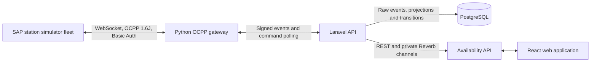
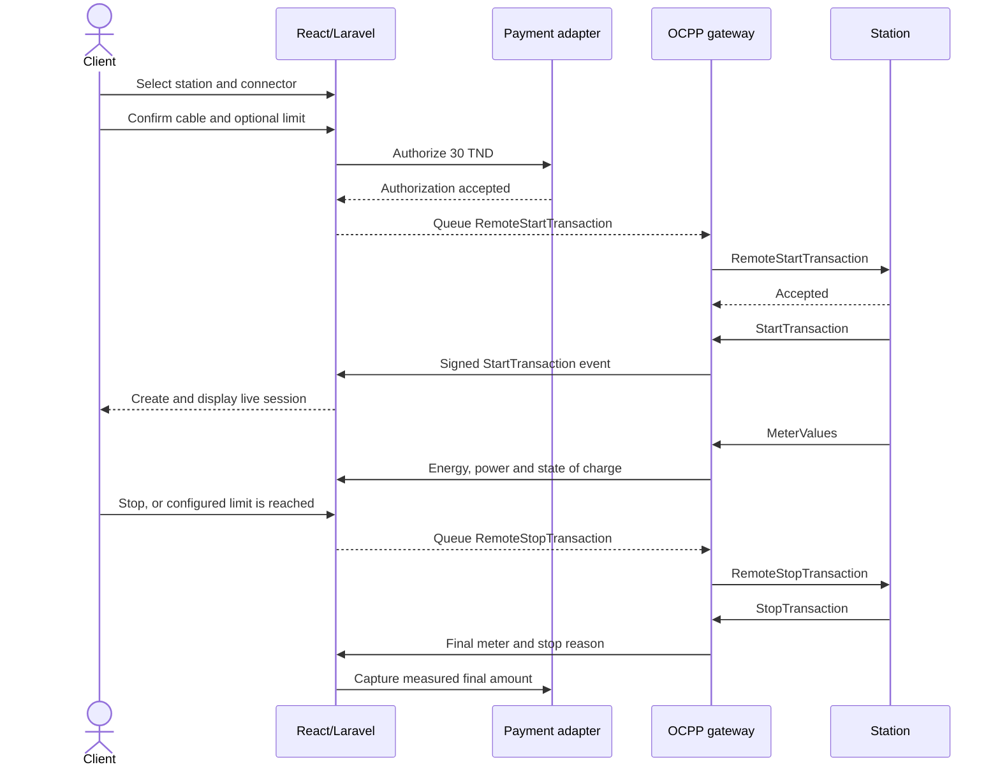

# OCPP 1.6 JSON Integration

## Scope

This integration establishes real OCPP 1.6 JSON connections between a configurable fleet of simulated charging
stations and ChargeTrackr. Laravel stores the raw technical evidence, calculates business availability,
creates deduplicated operational alerts and broadcasts state changes to the web application.

## Architecture



Responsibilities:

- The SAP simulator behaves like an OCPP charge point and never accesses application data.
- The Python gateway owns long-lived WebSocket connections and OCPP request/response handling.
- Laravel authenticates station identities, validates signed gateway requests, stores events and
  remains the only service that writes to PostgreSQL.
- PostgreSQL stores immutable event evidence and the latest raw telemetry separately from the
  current business status.

The gateway must not calculate availability, access PostgreSQL directly or expose station secrets.

## Station commissioning

Administrators and operators create a simulated station through one atomic workflow:

1. Define the station identity and exact map position.
2. Select a verified simulator hardware profile.
3. Review and create the station, connectors and OCPP access in one database transaction.

The selected profile is the server-side source of truth for the model, maximum power and connector
layout. The queue worker provisions the SAP simulator through a private authenticated control
service. The UI then follows `queued`, `provisioning`, `provisioned` or `failed` without displaying a
shell command or simulator secret.

The OCPP identity is unique and can differ from the internal reference, although keeping both equal
is recommended. Connector labels such as `A1` are user-facing; `ocpp_connector_id` must match the
integer sent by the device. The SAP simulator profiles use contiguous IDs starting at `1`.

For an external station, configure the device with the WebSocket URL, username and one-time password
shown after creation. Credential rotation invalidates the previous password and applies when the
station reconnects. The plaintext password is never returned by station detail APIs.

## Availability rules

Only provisioned OCPP 1.6J stations use calculated statuses. The local fleet seeds every station as
offline and lets OCPP connection and status evidence determine its operational state. The calculation priority is:

1. Manual disable.
2. Planned maintenance.
3. Communication loss.
4. Latest connector states reported by OCPP.

| Evidence | Station result | Connector result |
|---|---|---|
| Manual disable | `unavailable` | `unavailable` |
| Planned maintenance | `maintenance` | `maintenance` |
| Explicit WebSocket close or 90 seconds without any OCPP message | `offline` | `offline` |
| At least one connector `Available` | `available` | Per connector event |
| No free connector and at least one active connector | `charging` | `charging` |
| No free connector and at least one reserved connector | `reserved` | `reserved` |
| No usable connector and at least one fault | `faulted` | `faulted` |
| Connected but no usable/status evidence | `unavailable` | `unavailable` |

The gateway negotiates a 30-second heartbeat. Laravel runs `availability:refresh` every 30 seconds;
90 seconds therefore corresponds to three missed heartbeat periods. Any newer OCPP message also
proves that the station is alive. Late `StatusNotification` messages cannot replace newer evidence.

Every state/reason/source change is recorded in `availability_transitions`. Communication-loss and
connector-fault alerts use stable deduplication keys, reopen on recurrence and resolve automatically
when the condition clears.

## Protocol contract

The local SAP simulator connects to:

```text
ws://<gateway-host>:9000/ocpp/<station-identity>
```

Physical stations and every non-local deployment connect through:

```text
wss://<public-gateway-host>/ocpp/<station-identity>
```

The connection requires the `ocpp1.6` WebSocket subprotocol and HTTP Basic Auth. The username must
equal the path identity. Laravel stores only a password hash for each station.

The gateway rejects an identity/username mismatch locally with WebSocket code `1008`, before
calling Laravel. If station authentication succeeds but the opening event cannot be persisted, the
gateway closes with `1013` and starts neither the OCPP handler nor command polling. The charge point
may then reconnect using its normal retry policy; only a successfully persisted opening can later
produce a closing event.

The implemented OCPP messages are:

- `BootNotification`: registers the station and negotiates the 30-second heartbeat interval.
- `Heartbeat`: records proof that the station can still communicate with the platform.
- `StatusNotification`: records the connector or station status reported by OCPP.
- `Authorize`: validates a hashed idTag against an active, verified client account.
- `StartTransaction`: creates an auditable technical transaction and a tariff-snapshotted client session.
- `MeterValues`: normalizes energy and power samples and updates provisional energy and cost.
- `StopTransaction`: applies the final meter, stop reason, terminal state and billable amount.
- `RemoteStartTransaction`: asks the station to start with a short-lived virtual client idTag.
- `RemoteStopTransaction`: asks the station to end an active OCPP transaction.
- `Reset` with type `Soft`: restarts a connected station without exposing Hard Reset in the API.
- `UnlockConnector`: asks a connected station to release one physical connector lock.
- `ChangeAvailability`: synchronizes the platform maintenance override with connector `0` of a connected station.
- Connection open/close: records the transport lifecycle independently of OCPP messages.

Every message is normalized to a UUID event with connection ID, OCPP message ID, action, payload,
protocol version and occurrence time.

The local simulator samples active transactions every 2 seconds so the driver workflow feels
responsive during demonstrations. This setting is limited to the development profile; real charge
points keep their own negotiated telemetry cadence, while availability supervision continues to use
the independent 30-second heartbeat and 90-second connectivity timeout.

## Internal API security

The gateway calls only:

```text
POST /api/internal/ocpp/authenticate
POST /api/internal/ocpp/events
POST /api/internal/ocpp/commands/claim
POST /api/internal/ocpp/commands/{command}/result
```

Each request includes a Unix timestamp, a UUID request ID and an HMAC-SHA256 signature over the
exact request body. Laravel rejects invalid signatures, stale timestamps and replayed request IDs.
The event API is idempotent: a retry returns the existing event, while reuse of an identifier with
different content is rejected.

HMAC provides integrity and service authentication, not encryption. The gateway enforces the
transport boundary at startup:

- `OCPP_ENVIRONMENT=local|development|testing` may use `ws://` and may call Laravel over `http://`
  only on loopback or a known local Docker host.
- Any other environment refuses to start with `OCPP_GATEWAY_TLS_MODE=disabled`.
- `OCPP_GATEWAY_TLS_MODE=direct` loads a certificate and private key and serves OCPP over TLS.
- `OCPP_GATEWAY_TLS_MODE=proxy` accepts a private plain WebSocket hop only behind a trusted TLS
  reverse proxy; its declared public URL must still be `wss://`.
- Any non-local gateway-to-Laravel URL must use `https://`. Certificate verification is always
  enabled; `OCPP_LARAVEL_CA_FILE` may point to a private CA bundle.

Direct TLS requires these additional values and read-only certificate mounts:

```dotenv
OCPP_ENVIRONMENT=production
OCPP_GATEWAY_TLS_MODE=direct
OCPP_GATEWAY_PUBLIC_URL=wss://ocpp.example.com/ocpp
OCPP_GATEWAY_TLS_CERTIFICATE_FILE=/run/tls/fullchain.pem
OCPP_GATEWAY_TLS_PRIVATE_KEY_FILE=/run/tls/privkey.pem
OCPP_LARAVEL_BASE_URL=https://api.example.com/api/internal/ocpp
```

TLS 1.2 is the minimum accepted protocol. The local Compose stack deliberately remains on
`ws://ocpp-gateway:9000` because it is bound to loopback and used only by the deterministic
simulator. It must not be exposed as a production topology.

Secrets are generated by `scripts/configure-ocpp-env.ps1` and stored only in:

```text
backend/.env
infra/ocpp/.env
```

Both files are ignored by Git. Rotate the local OCPP credentials with:

```powershell
powershell -ExecutionPolicy Bypass -File scripts/configure-ocpp-env.ps1 -Rotate
```

Provision the simulator fleet again after rotating its secret. The shared simulator credential is
limited to local development; physical stations must receive independent credentials.

## Remote charging lifecycle

The client workflow is deliberately split into a charging attempt and a charging session:



Important invariants:

- A payment authorization and an accepted remote command do not create a billable session.
- Only the station's `StartTransaction` creates the session and confirms that energy delivery began.
- A rejected or expired start releases the authorization automatically.
- The final `StopTransaction` is the source of truth for energy and triggers queued payment capture.
- Energy, amount and duration limits queue a remote stop; the 30 TND authorization is also the
  default amount safeguard when no lower amount limit is selected.
- Command payloads are encrypted at rest, expire automatically and are claimed by only one active
  gateway connection.
- Connector QR codes contain only an authenticated application deep link. They never contain an
  idTag, station password, payment token or gateway secret.

The visual flow is: station, connector, physical connection, payment/limit, then OCPP progress.
The physical connection step does not trust a client-side checkbox. It polls the latest connector
projection and advances only after the charge point reports OCPP `Preparing`, which represents a
vehicle cable connected before authorization.
Connector artwork comes from `react-charging-station-connector-icons`. The physical connection step
contains a reserved media area for a future reviewed WebM or MP4 guide.

## Simulation Lab

`/simulation-lab` is an authenticated workspace outside the role dashboards. It presents every
simulator-backed station in the user's organization, its connector projections and a bounded stream
of sanitized OCPP events.

Access is intentionally split by responsibility:

| Role | View station and connector pulses | Run closed simulator actions |
|---|---:|---:|
| Organization administrator | Yes | Yes |
| Operator | Yes | Yes |
| Technician | Yes | No |
| Client | No | No |

The lab exposes only reviewed actions: connect, disconnect, heartbeat, plug, unplug, fault,
recovery and deterministic test scenarios. Central-system commands such as soft reset and unlock
remain distinct from physical simulator actions and retain their existing authorization, audit and
OCPP command lifecycle.

Each pulse is derived from a persisted OCPP event. The public response contains only the event
category, action, connector reference, projected status, processing outcome and occurrence time.
Raw payloads, response payloads, RFID identifiers, station passwords, simulator control URLs and
control tokens are never returned. The event stream is limited to the 40 most recent entries.

The station detail page links to the lab for simulator-backed stations. It no longer embeds the
command console, which keeps simulation tooling separate from normal asset administration.

## Local workflow

Prerequisites are Docker Desktop with the WSL2 engine, the local PostgreSQL database and Laravel.
No Linux distribution needs to be installed manually for Docker Desktop.

Start Laravel in a terminal accessible to Docker:

```bash
npm run dev:backend:ocpp
```

In another terminal:

```bash
npm run ocpp:configure
cd backend && C:\php\php.exe artisan migrate
npm run ocpp:provision-fleet
npm run ocpp:up
```

The fleet manifest is `infra/ocpp/simulator/stations.json`. `npm run ocpp:up` builds both runtime images and the shared simulator CLI
image before starting the gateway and simulator.

Stations created from the application are provisioned automatically while the queue worker and the
private simulator control service are running. The runtime fleet manifest is stored in a Docker
volume, so dynamically created stations reconnect after a simulator restart.

`npm run ocpp:add-simulator-station -- <identity>` remains available only as a developer recovery
tool for legacy local records. It is not part of the administrator or operator workflow.

Run the queue, scheduler and Reverb server in separate terminals:

```bash
npm run infra:configure:redis
npm run infra:up:redis
npm run dev:queue
npm run dev:scheduler
npm run dev:reverb
```

Run the deterministic test scenario:

```bash
npm run ocpp:scenario -- CT-ARI-006
```

It sends `Available`, then `Charging`, then `Faulted` for connector 1 of the selected station. Return
that connector to service with `npm run ocpp:unplug -- CT-ARI-006 1`.

Run the complete transaction scenario with the provisioned `TEST-TAG-001` client tag:

```bash
cd backend && C:\php\php.exe artisan ocpp:provision-id-tag ocpp-client@chargetrackr.local --token=TEST-TAG-001
npm run ocpp:transaction-scenario -- CT-HAM-031
```

It executes `Authorize -> StartTransaction -> MeterValues -> StopTransaction`, then returns the
connector to `Available`. Laravel calculates energy and price from the real simulator meter values.

To test the client-initiated flow, keep the gateway and simulator running, sign in as a verified
client, open `/find-station`, then choose `Start charging` on `CT-TUN-001`. Select connector `A1`,
continue to the physical connection step and simulate plugging in from another terminal:

```bash
npm run ocpp:plug -- CT-TUN-001 1
```

The interface detects `Preparing` and advances to payment without manual confirmation. Complete the remaining steps
and keep the drawer open while the gateway claims the command. The session appears only after the
simulator answers with `StartTransaction`. Use `Stop charging` from `/my-sessions`; the final
`StopTransaction` completes the session and captures the simulated payment. The development-only
payment outcome selector can also verify the decline path without creating an OCPP command.

If the workflow is abandoned before charging starts, return the simulated connector to its physical
unplugged state with `npm run ocpp:unplug -- CT-TUN-001 1`.

Any station and connector from the manifest can be targeted. A complete connectivity check is:

```bash
npm run ocpp:disconnect -- CT-SFX-017
npm run ocpp:status -- CT-SFX-017
npm run ocpp:connect -- CT-SFX-017
```

Disconnect stops only that simulator station. Reconnect starts it again, causing a new OCPP
connection, `BootNotification`, connector statuses and recurring `Heartbeat` messages. Use
`npm run ocpp:stop-transaction -- CT-HAM-031` to cleanly stop a station-initiated test transaction
that was interrupted before the scenario script could finish.

The deterministic automated contract can be run without Docker:

```bash
cd backend && C:\php\php.exe artisan test --compact tests/Feature/RemoteChargingWorkflowTest.php
```

It covers successful remote start/stop and capture, payment refusal, station rejection/release and
automatic remote stop when an energy limit is reached.

### Supervision command scenario

Start the fleet, sign in as an administrator or operator, then open the detail page for a connected
simulator station such as `CT-TUN-001`. The station page provides three auditable scenarios:

1. Use `Restart station`, confirm the Soft Reset, then verify that the history progresses from
   `Queued` to `Sent` and finally `Accepted` or `Rejected`. A successful reset can briefly reconnect
   the simulator WebSocket.
2. Run `npm run ocpp:plug -- CT-TUN-001 1`, open the Connectors tab and use `Unlock` on connector
   `A1`. The command history retains both the target connector and the SAP simulator response.
3. Use `Set maintenance mode`. The business projection changes immediately and the connected
   simulator receives `ChangeAvailability(Inoperative)` for connector `0`. Leaving maintenance sends
   `ChangeAvailability(Operative)`. If the station is offline, only the safe local override is changed
   and the interface explicitly reports that no OCPP command was sent.

The deterministic command contracts do not require Docker:

```bash
cd backend && C:\php\php.exe artisan test --compact tests/Feature/OcppSupervisionApiTest.php
cd ocpp-gateway && python -m pytest -q
```

These tests cover organization isolation, Admin/Operator execution, Technician read-only history,
encrypted payloads, duplicate prevention, the 60-second pending timeout, terminal accepted commands,
Soft Reset enforcement and OCPP response normalization.

Inspect the non-secret station, connector, event and transaction state:

```bash
npm run ocpp:status -- CT-TUN-014
npm run ocpp:fleet-status
```

Stop the containers with `npm run ocpp:down`.

The simulator's authenticated control WebSocket is exposed on `ws://localhost:8082`.
It is consumed by the provided `ocpp:*` CLI commands and is not a browser page.
Port `8080` is reserved for Reverb.

## Simulator console

The station detail page exposes a `Simulator console` tab only when the station was commissioned
with the `Local SAP simulator` target. It provides the same controlled test operations as the local
CLI without exposing the simulator port, its control token, station credentials or an arbitrary
command input in the browser.

Access follows the existing station command policies:

- Super Admin can inspect and operate simulator stations across the platform.
- Admin and Operator can inspect and operate simulator stations in their organization.
- Technician can inspect simulator state and action history, but cannot execute actions.
- Client has no access to the console or its API.

The console intentionally separates two responsibilities:

- `Station`, `Physical connector` and `Scenarios` reproduce simulator-side events such as connect,
  disconnect, heartbeat, plug, unplug, fault, recovery and deterministic test cycles.
- `Central system` reuses the audited ChargeTrackr OCPP commands for Soft Reset, UnlockConnector and
  maintenance-mode ChangeAvailability.

Simulator-side requests use `POST /api/stations/{station}/simulator/actions`. They are organization
scoped, rate limited, queued and serialized per station. Every request keeps its requester, target
connector, timestamps, outcome and sanitized result in `ocpp_simulator_actions`. The read endpoint
`GET /api/stations/{station}/simulator` combines that history with the sanitized live state returned
by the private `ocpp-simulator-control` service. Only the backend network can reach this service.

Use a repeatable scenario such as `Cable cycle` for demonstrations. The action should progress from
`Queued` to `Succeeded`, the selected connector should return to `Available`, and the audit trail
should identify the requesting user. A failed adapter or simulator request is recorded with a
generic user-facing message while technical details remain in server logs.

## Data model boundary

`ocpp_events` is the audit stream. Station and connector columns prefixed with `ocpp_` are the
latest raw technical projection. Existing `status` columns remain the business projection consumed
by users.

For example, receiving raw `Faulted` first updates `connectors.ocpp_status`. The availability engine
then derives `connectors.status`, records the transition, reconciles the automatic alert and emits a
queued Reverb event. REST resources expose both the raw OCPP evidence and the calculated business
state, but clients use the calculated state for operational decisions.

`ocpp_transactions` is the technical transaction ledger. Rejected starts are retained there but do
not create billable sessions. `charging_sessions` contains only accepted business sessions and keeps
the tariff and plan snapshot used at start. `ocpp_meter_samples` stores normalized samples while the
original payload remains immutable in `ocpp_events`.

If communication is lost before `StopTransaction`, the technical transaction moves to
`awaiting_reconciliation` and the session is marked interrupted without a final meter. It cannot be
paid in that state. A later meter sample resumes it; a delayed `StopTransaction` reconciles and
finalizes it. This prevents the platform from inventing energy or a final charge.
